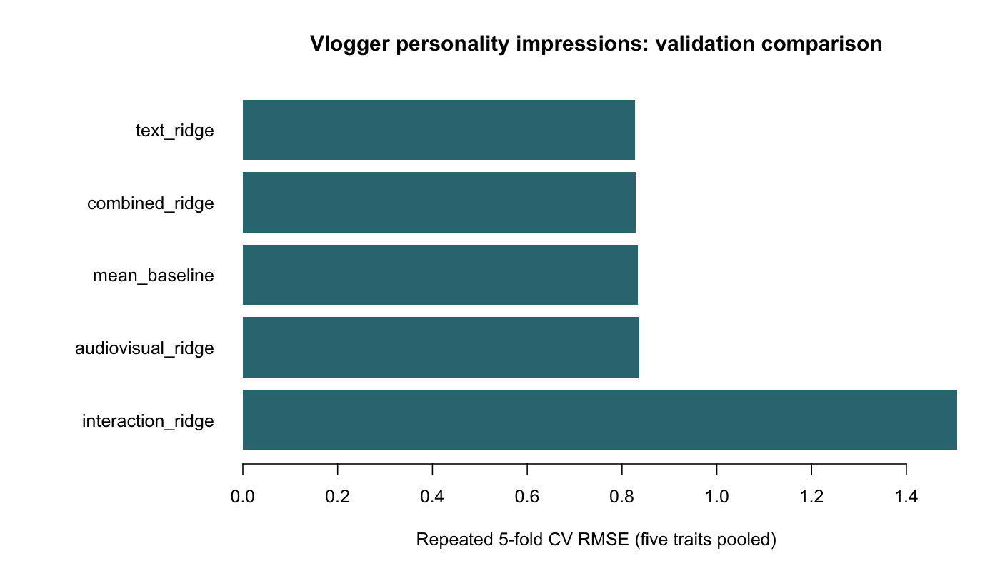

# Predicting Big Five Impressions from YouTube Vlogs

A 2023 group coursework project studying whether transcripts and audiovisual measures predict observers' personality impressions. The five outcomes are extraversion, agreeableness, conscientiousness, emotional stability, and openness; these ratings are not clinical assessments.

## Validation results

The current R workflow compares predefined feature sets using **5-fold cross-validation repeated 5 times** on all **324 labelled vloggers**. Each vlogger belongs to one fold within each repeat. Feature scaling and removal of constant predictors use training folds only. Ridge regression has a fixed penalty of 10; it is not tuned on the evaluation folds.

| Specification | Pooled CV RMSE |
| --- | ---: |
| Simple text features + ridge | 0.827 |
| Text + audiovisual features + ridge | 0.830 |
| Training-fold mean baseline | 0.834 |
| Audiovisual features + ridge | 0.836 |
| Combined features with quadratic terms + ridge | 1.507 |

The text model provides a **small** improvement over the mean baseline. The interaction specification performs much worse. These exploratory CV comparisons do not establish a decisive winner or provide an independent test-set score. RMSE pools squared errors across the five trait scales; [per-trait results](results/cv_by_trait.csv) are included.



The full workflow ran on 8 October 2026 and generated 400 prediction rows for the 80 unlabelled vloggers. Their scores are withheld, so this repository cannot measure final test RMSE. Aggregate results and the R session are in `results/`; raw data, fold assignments with IDs, and individual predictions are excluded from Git.

## Relationship to the original project

The original notebook explores NRC emotion counts, stepwise selection, and multivariate regression. It reports training RMSE of 0.651 for an interaction-rich model and a submitted competition RMSE of 0.845. Those are historical coursework scores, not the CV estimates above.

The current validation is a new, simpler comparison: text features are word count, sentence count, long-word count (at least 11 letters), and type-token ratio; audiovisual predictors are the supplied `mean.*` columns. It does not reproduce the notebook's NRC feature extraction or reuse its outcome-guided feature choices. The notebook is retained as source, with cached outputs removed to avoid redistributing transcript excerpts.

## Data and running

The YouTube Personality Dataset is not distributed here because open redistribution terms could not be established. [Data sources and required files](DATA_SOURCES.md) explain how to run with an authorized local copy. The original Idiap source has retired its download.

Requires **R only**, with no additional packages. From the repository root:

```bash
Rscript analysis/vlogger_big_five.R /path/to/youtube-personality
```

Alternatively, place the authorized data in the ignored `data/bda-2023-profiling-personality/youtube-personality/` directory and run without an argument. The script saves aggregate CV tables and a figure, then fits the best CV specification to all training rows and writes local competition-format predictions.

## Files

```text
Vlogger-Big-Five-Prediction/
├── analysis/vlogger_big_five.R
├── notebooks/original_kaggle_notebook.ipynb
├── results/                   # Aggregate validation tables and figure
├── DATA_SOURCES.md
├── .gitignore
└── README.md
```

## Credits

Laura Maria Fetz, Roman Esseveld, and Bram le Fèbre. Dataset and publication attribution are recorded in [DATA_SOURCES.md](DATA_SOURCES.md).
